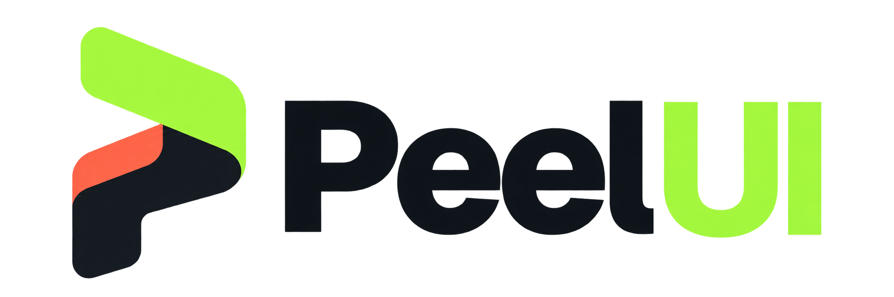

<div align="center">

<a href="https://peel-ui.vercel.app">
  
</a>

# Peel UI

**Tactile React components, built around deliberate motion.**

[Live demos](https://peel-ui.vercel.app) · [Components](https://peel-ui.vercel.app/components) · [Follow on X](https://x.com/Sumit1476136)


</div>

<!-- After recording a short GIF, uncomment:
<p align="center"></p>
-->

Peel UI is a shadcn registry of React components that treat the screen like machined hardware: drag tracks with magnetic detents, springs instead of easing curves, controls that settle instead of fade. Install a component and you own the code. There is no package to depend on.

## Components

| Component | Install name | Interaction |
| --- | --- | --- |
| Slide to Confirm | `slide-to-confirm` | Friction drag with a magnetic confirmation threshold |
| Magnetic Split Button | `magnetic-split-button` | Primary and secondary actions that pull apart on a spring latch |
| Tactile OTP Input | `tactile-otp-input` | Numeric input with a floating focus frame |
| Privacy Shutter | `privacy-shutter` | Drag-to-peek cover for sensitive values |
| Voice Pill | `voice-pill` | Audio capture with a live waveform and slide-to-cancel |
| Save State Pill | `save-state-pill` | Save, offline, retry and conflict states in one morphing pill |
| Filter Chips | `filter-chips` | Single or multi-select chips that reflow on a spring |
| Note Button | `note-button` | A button that morphs into a persistent scratchpad |
| Skeleton Handoff | `skeleton-handoff` | Loading blocks travel into matching content without scaling real text |
| Moiré Field | `moire-field` | Full-bleed interference pattern background with dual gratings and pointer damping |
| Moiré Intro | `moire-intro` | Progress-driven dual line gratings calm into register before a mechanical exit reveal |

## Install

```bash
npx shadcn@latest add Killersumit/peel-ui/slide-to-confirm
```

Swap `slide-to-confirm` for any install name above. The hosted URL form works too:

```bash
npx shadcn@latest add https://peel-ui.vercel.app/r/slide-to-confirm.json
```

Your project needs to be set up with `npx shadcn@latest init`, which provides `@/lib/utils`. The CLI installs each component's own dependencies.

## Run locally

```bash
git clone https://github.com/Killersumit/peel-ui.git
cd peel-ui
npm install
npm run dev
```

Components live in `src/components/ui`. After changing a component or `registry.json`, run `npm run registry:build`.

## License

[MIT](LICENSE)